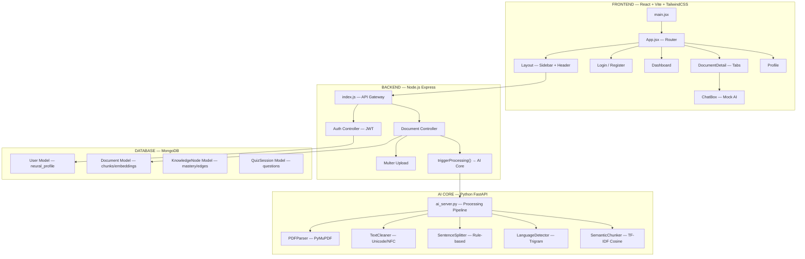
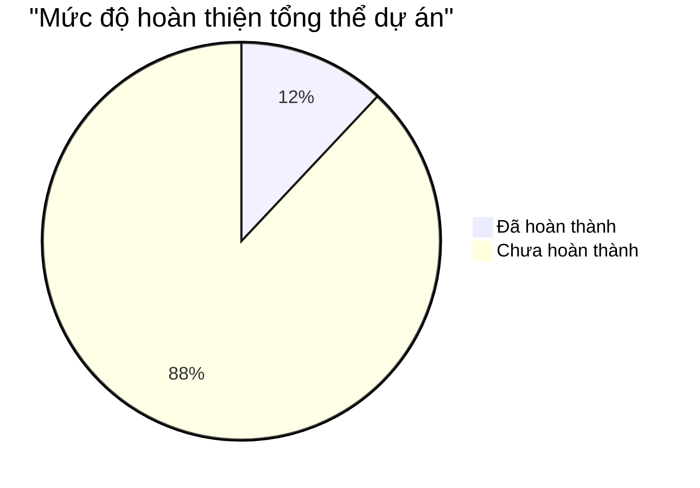

# 🔬 ĐÁNH GIÁ CHUYÊN SÂU & LỘ TRÌNH CHIẾN LƯỢC — NEUROVAULT AI LEARNING PLATFORM

## I. TỔNG QUAN KIẾN TRÚC HIỆN TẠI

---

## II. ĐÁNH GIÁ CÔNG TÂM TỪNG MODULE

### 🟢 2.1 Frontend (React + Vite) — **Hoàn thiện: ~15%**

| Thành phần | Trạng thái | Chi tiết |
|:---|:---|:---|
| Router & Auth Flow | ✅ Hoạt động | ProtectedRoute, JWT token management, Zustand store |
| Layout (Sidebar + Header) | ✅ Cơ bản | Sidebar navigation, user avatar, bell notification (static) |
| Login / Register | ✅ Hoạt động | Form validation, error display, gradient UI đẹp |
| Dashboard | ⚠️ Mock cứng | Hardcode 1 document ID duy nhất, không fetch API |
| DocumentDetail | ⚠️ Khung sườn | 5 tabs (Content/Chat/AI Actions/Flashcards/Quizzes) — chỉ Chat hoạt động |
| ChatBox | ❌ 100% Mock | `setTimeout` fake AI response, không kết nối backend |
| Profile | ✅ UI đẹp | Avatar upload hover effect, form — nhưng save chỉ gọi `alert()` |
| Responsive Design | ⚠️ Yếu | Chỉ có `lg:hidden` cho mobile logo, chưa responsive toàn diện |
| Animations/Transitions | ⚠️ Tối thiểu | Chỉ có hover effects cơ bản, thiếu micro-animations |
| Design System | ❌ Không có | Không có design tokens, chỉ 1 primary color `#10B981` |

**Vấn đề nghiêm trọng:** Dashboard hardcode document ID `6921ca43b4abe752a1af453e` — nếu DB trống → **màn hình trống**.

### 🟡 2.2 Backend Node.js (API Gateway) — **Hoàn thiện: ~35%**

| Thành phần | Trạng thái | Chi tiết |
|:---|:---|:---|
| Express Server Setup | ✅ Tốt | Helmet, CORS, body parsing, health check |
| Auth System | ✅ Hoạt động | Register/Login/Refresh/Logout, bcrypt hash, JWT pair |
| Document CRUD | ✅ Hoạt động | Upload (Multer), List/Get/Delete, pagination |
| AI Processing Trigger | ✅ Có logic | `triggerProcessing()` gọi AI Core, cập nhật status |
| Rate Limiting | ✅ Tốt | 3 tiers: general/auth/ai — thiết kế sẵn |
| Error Handler | ✅ Tốt | Xử lý Mongoose validation, duplicate key, CastError |
| Middleware Auth | ✅ Tốt | JWT verify, user lookup, token expired handling |
| File Upload | ✅ Tốt | UUID naming, file filter (PDF/TXT/MD/DOCX), size limit |
| **Models (DB Schema)** | ✅ **Thiết kế tốt** | User (neural_profile), Document (chunks + embeddings), KnowledgeNode (mastery + edges), QuizSession |

> [!IMPORTANT]
> **Điểm sáng:** Database schema được thiết kế rất tốt với `neural_profile` (learning_velocity, forgetting_params), `KnowledgeNode` (edges, mastery, centrality_score), và `QuizSession` (cognitive_load_estimate). Đây là nền tảng dữ liệu chuẩn cho adaptive learning.

**Thiếu hoàn toàn:**
- Không có routes/controllers cho KnowledgeNode và QuizSession
- Không có WebSocket/SSE cho real-time chat
- Không có route cho AI inference (chat, quiz gen, flashcard gen)
- Không có caching layer
- Không có logging system

### 🟠 2.3 AI Core (Python FastAPI) — **Hoàn thiện: ~20%**

| Module | Trạng thái | Chất lượng thuật toán |
|:---|:---|:---|
| PDFParser | ✅ White-box | Multi-column detection (heuristic), title extraction (font-size), OCR flagging |
| TextCleaner | ✅ White-box | NFC normalization, smart quotes, hyphenation fix, bullet normalize — **rất tốt** |
| SentenceSplitter | ✅ White-box | Abbreviation protection, number protection, Vietnamese-aware — **tốt** |
| LanguageDetector | ✅ White-box | Character trigram fingerprinting + cosine similarity + diacritical ratio — **sáng tạo** |
| SemanticChunker | ✅ White-box | TF-IDF sliding window + cosine drop detection + merge/split — **tốt** |
| Unit Tests | ✅ Có | 227 dòng test, coverage cho tất cả preprocessing modules |
| **Embedding Engine** | ❌ Chưa có | `embedding_vector: []`, `sparse_vector: {}` — placeholder |
| **Retrieval Engine (RAG)** | ❌ Chưa có | Không có vector search, không có hybrid retrieval |
| **Knowledge Graph Builder** | ❌ Chưa có | KnowledgeNode model có nhưng không có logic build |
| **Quiz Generator** | ❌ Chưa có | QuizSession model có nhưng không có generation logic |
| **Chat/QA Engine** | ❌ Chưa có | Không có NLU, không có response generation |
| **Spaced Repetition** | ❌ Chưa có | `mastery` schema có nhưng không có SM-2/FSRS algorithm |

> [!WARNING]
> **Vấn đề cốt lõi:** AI Core hiện chỉ hoàn thành **Phase 1: Preprocessing** (Parse → Clean → Detect → Split → Chunk). Tất cả các tầng trí tuệ (Embedding, Retrieval, Reasoning, Generation) đều chưa tồn tại. Đây là lý do ChatBox phải dùng mock data.

---

## III. ĐÁNH GIÁ TỔNG THỂ % HOÀN THIỆN

| Dimension | Weight | Completion | Weighted |
|:---|:---|:---|:---|
| Frontend UI/UX | 20% | 15% | 3.0% |
| Backend API | 15% | 35% | 5.25% |
| AI Preprocessing | 10% | 80% | 8.0% |
| AI Embedding/Retrieval | 15% | 0% | 0% |
| AI Reasoning/Generation | 20% | 0% | 0% |
| Knowledge Graph | 10% | 0% (schema only) | 0% |
| Adaptive Learning Engine | 10% | 0% (schema only) | 0% |

### **→ TỔNG: ~12% hoàn thiện**

> [!CAUTION]
> Dự án hiện tại chỉ ở mức **khung sườn + preprocessing pipeline**. Frontend hiển thị màn hình trống vì Dashboard hardcode ID và không fetch data thật. AI Core chỉ biết "đọc" tài liệu nhưng chưa biết "hiểu" hay "trả lời".

---

## IV. NGUYÊN NHÂN MÀN HÌNH TRỐNG

1. **Dashboard.jsx** hardcode link đến document ID `6921ca43b4abe752a1af453e` — không gọi API `GET /api/documents`
2. Backend server có thể chưa chạy (chưa install dependencies, chưa start MongoDB)
3. Frontend `npm install` có thể chưa chạy → thiếu `node_modules`
4. Vite proxy `/api` → `localhost:5000` nhưng server chưa start

---

## V. LỘ TRÌNH CHIẾN LƯỢC — BIẾN NEUROVAULT THÀNH HỆ SINH THÁI CẤP ENTERPRISE

> [!IMPORTANT]
> **Triết lý cốt lõi:** 100% White-box — Tự xây dựng mọi thuật toán AI từ đầu. Không phụ thuộc OpenAI, Anthropic, hay bất kỳ API bên thứ 3 nào. Sử dụng open-source models chạy local (Ollama + llama.cpp).

### Phase 1: 🔧 CẤP CỨU — Làm Frontend Hoạt Động (1 tuần)
**Mục tiêu:** Từ "màn hình trống" → ứng dụng chạy được end-to-end

- [ ] **Fix Dashboard:** Gọi API `GET /api/documents` thay vì hardcode, hiển thị empty state đẹp
- [ ] **Fix Document Upload Flow:** Tạo upload modal/page hoàn chỉnh với drag-drop
- [ ] **Start Backend:** Đảm bảo MongoDB + Node.js server + AI Core chạy được
- [ ] **Wire ChatBox → Backend:** Thay mock `setTimeout` bằng API call thực
- [ ] **Fix Profile Save:** Gọi API update thay vì `alert()`
- [ ] **Thêm Empty States & Loading States** cho tất cả pages

---

### Phase 2: 🧠 XÂY DỰNG NÃO BỘ AI — Embedding & Retrieval (2-3 tuần)
**Mục tiêu:** AI có thể "hiểu" nội dung tài liệu

#### [NEW] `backend/ai_core/embedding/embedding_engine.py`
- Tự xây Word2Vec / FastText training từ scratch (white-box)
- Hoặc dùng open-source pre-trained model (all-MiniLM-L6-v2 via sentence-transformers) — chạy 100% local
- Tính embedding cho mỗi chunk → lưu vào MongoDB

#### [NEW] `backend/ai_core/retrieval/vector_store.py`
- Tự xây HNSW (Hierarchical Navigable Small World) index từ scratch
- Hoặc dùng FAISS (Facebook AI Similarity Search) — 100% local
- Hybrid retrieval: Dense (vector) + Sparse (BM25)

#### [NEW] `backend/ai_core/retrieval/bm25.py`
- Tự implement BM25 scoring algorithm (white-box)
- TF-IDF variant với document length normalization

#### [NEW] `backend/ai_core/retrieval/hybrid_ranker.py`
- Reciprocal Rank Fusion (RRF) để kết hợp dense + sparse results
- Re-ranking pipeline

---

### Phase 3: 💬 XÂY DỰNG HỆ THỐNG CHAT — Local LLM Inference (2-3 tuần)
**Mục tiêu:** AI trả lời câu hỏi dựa trên tài liệu (RAG hoàn chỉnh)

#### [NEW] `backend/ai_core/inference/llm_engine.py`
- Tích hợp Ollama API (local) hoặc llama.cpp qua Python binding
- Sử dụng model: Gemma 2B/7B, Phi-3-mini, hoặc Qwen 2.5 — chạy 100% trên máy
- Prompt engineering cho educational context

#### [NEW] `backend/ai_core/inference/rag_pipeline.py`
- Kết hợp retrieval + generation
- Context window management
- Citation injection (trích dẫn nguồn từ tài liệu)

#### [MODIFY] `backend/server/routes/` — Thêm Chat Routes
- WebSocket/SSE cho streaming response
- Chat history management
- Context-aware follow-up questions

---

### Phase 4: 🕸️ XÂY DỰNG KNOWLEDGE GRAPH & ADAPTIVE LEARNING (3-4 tuần)
**Mục tiêu:** Hệ thống hiểu mối quan hệ giữa các khái niệm và thích ứng theo người học

#### [NEW] `backend/ai_core/knowledge/graph_builder.py`
- Tự extract entities và relationships từ chunks
- Xây dựng Knowledge Graph (concept → prerequisite → related)
- Community detection (Louvain algorithm) cho topic clustering

#### [NEW] `backend/ai_core/knowledge/concept_extractor.py`
- TF-IDF based keyphrase extraction
- TextRank algorithm cho keyword extraction (white-box)
- Named Entity Recognition đơn giản (pattern-based)

#### [NEW] `backend/ai_core/adaptive/spaced_repetition.py`
- Implement FSRS (Free Spaced Repetition Scheduler) — thuật toán hiện đại nhất 2025
- Hoặc implement SM-2 (SuperMemo 2) cải tiến
- Dynamic scheduling dựa trên `neural_profile` của user

#### [NEW] `backend/ai_core/adaptive/learner_model.py`
- Bayesian Knowledge Tracing (BKT) — ước tính xác suất mastery
- Item Response Theory (IRT) — adaptive difficulty calibration
- Learning velocity tracking

---

### Phase 5: 📝 QUIZ & FLASHCARD GENERATION ENGINE (2-3 tuần)
**Mục tiêu:** AI tự tạo câu hỏi, flashcard thông minh

#### [NEW] `backend/ai_core/generation/quiz_generator.py`
- Template-based MCQ generation (từ Knowledge Graph)
- Distractor generation (wrong answers gần đúng dựa trên concept similarity)
- Difficulty calibration via IRT
- Question type: MCQ, Fill-blank, True/False, Socratic

#### [NEW] `backend/ai_core/generation/flashcard_generator.py`
- Cloze deletion extraction
- Key concept → definition pair extraction
- Spaced repetition integration

#### [NEW] `backend/ai_core/generation/summary_generator.py`
- Extractive summarization (TextRank)
- Hierarchical summarization (chapter → section → paragraph)

---

### Phase 6: 🎨 NÂNG CẤP FRONTEND THÀNH PREMIUM ECOSYSTEM (3-4 tuần)
**Mục tiêu:** UI/UX ngang tầm Notion/Duolingo/Quizlet

#### Frontend Architecture Overhaul
- [ ] **Design System hoàn chỉnh:** Color tokens, typography scale (Inter/Outfit), spacing system, component library
- [ ] **Dark Mode:** Hỗ trợ light/dark theme toggle
- [ ] **Landing Page:** Hero section, features showcase, social proof — thu hút user mới
- [ ] **Real-time Chat UI:** Streaming text effect, markdown rendering, code highlighting, citation cards
- [ ] **Knowledge Graph Visualization:** Interactive D3.js/Vis.js graph explorer
- [ ] **Quiz Experience:** Gamified quiz flow với progress bars, streaks, XP system
- [ ] **Flashcard UI:** Swipeable cards, flip animations, progress tracking
- [ ] **Analytics Dashboard:** Learning velocity charts, mastery heatmap, streak calendar
- [ ] **Document Library:** Grid/list view, search, filters, batch operations
- [ ] **Mobile Responsive:** Full PWA support

---

## VI. SO SÁNH VỚI CÁC ĐỐI THỦ LỚN

| Tính năng | Duolingo | Quizlet | Notion AI | **NEUROVAULT (Target)** |
|:---|:---|:---|:---|:---|
| Document Ingestion | ❌ | ✅ | ✅ | ✅ White-box PDF/TXT/DOCX |
| AI Chat (RAG) | ❌ | ❌ | ✅ (API) | ✅ **100% Local** |
| Knowledge Graph | ❌ | ❌ | ❌ | ✅ **Auto-generated** |
| Adaptive Quiz | ✅ (API) | ⚠️ Cơ bản | ❌ | ✅ **IRT + FSRS** |
| Spaced Repetition | ✅ | ✅ | ❌ | ✅ **FSRS Algorithm** |
| Gamification | ✅✅✅ | ✅ | ❌ | ✅ XP/Streak/Leaderboard |
| White-box AI | ❌ | ❌ | ❌ | ✅✅✅ **Toàn bộ** |
| Privacy (No API) | ❌ | ❌ | ❌ | ✅✅✅ **100% Local** |

---

## VII. STACK CÔNG NGHỆ ĐỀ XUẤT

| Layer | Công nghệ | Lý do |
|:---|:---|:---|
| Frontend | React 18 + Vite + CSS Modules/Vanilla CSS | Nhanh, linh hoạt, không phụ thuộc |
| State Management | Zustand (giữ nguyên) | Nhẹ, đơn giản, đủ mạnh |
| Backend API | Node.js Express (giữ nguyên) | Ecosystem lớn, proxy tốt |
| AI Engine | Python FastAPI (giữ nguyên) | Hệ sinh thái ML tốt nhất |
| LLM Inference | Ollama + Gemma 2/Qwen 2.5 + llama.cpp | 100% local, Apple Silicon optimized |
| Embedding | sentence-transformers (all-MiniLM-L6-v2) | Local, nhẹ, chính xác |
| Vector Store | FAISS hoặc tự xây HNSW | Không cần Pinecone/Weaviate |
| Database | MongoDB (giữ nguyên) | Schema linh hoạt cho AI data |
| Real-time | WebSocket (Socket.io) | Chat streaming, live updates |
| Visualization | D3.js / Vis.js | Knowledge Graph rendering |

---

## VIII. CÂU HỎI CẦN XÁC NHẬN TỪ BẠN

> [!IMPORTANT]
> Trước khi bắt tay triển khai, tôi cần bạn xác nhận:

1. **Ưu tiên Phase nào trước?** Phase 1 (cấp cứu Frontend) hay Phase 2 (AI brain)?
2. **Hardware target là gì?** MacBook M1/M2/M3? Bao nhiêu RAM? (Ảnh hưởng đến model selection)
3. **Ngôn ngữ mục tiêu?** Chỉ tiếng Việt? Hay cả Anh + Việt?
4. **LLM model preference?** Gemma 2B (nhẹ, nhanh) hay Qwen 2.5 7B (mạnh hơn)?
5. **Có muốn tôi bắt đầu Phase 1 ngay** (fix màn hình trống, wire up APIs)?
6. **TailwindCSS hay Vanilla CSS?** Hiện tại dùng Tailwind — muốn giữ hay chuyển?
