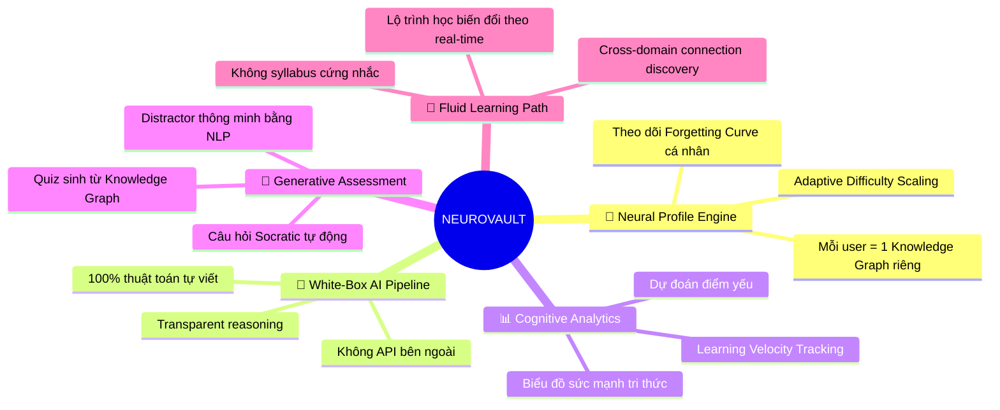
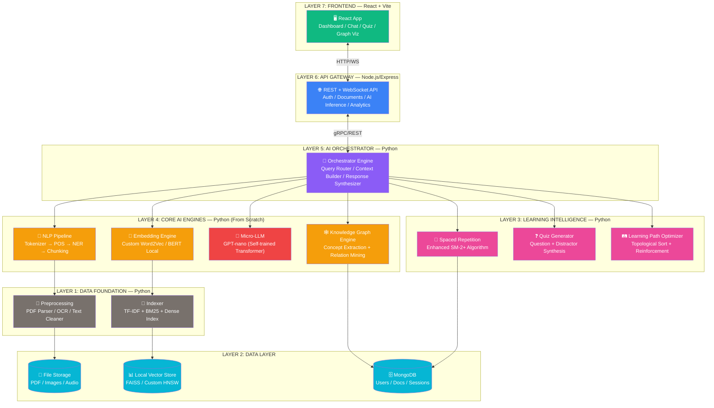
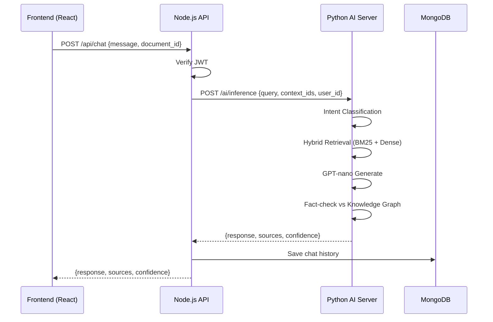
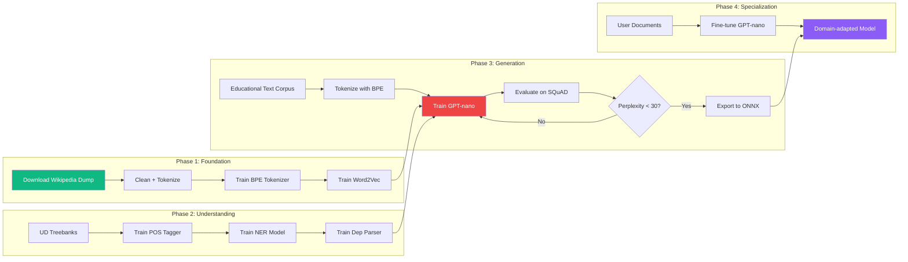

# 🧠 AI LEARNING PLATFORM — MASTER BLUEPRINT 2027

## Tên Mã Dự Án: **NEUROVAULT** — Neuromorphic Adaptive Vault of Understanding

> *"Không lặp lại những gì thế giới đã làm. Xây dựng một bộ não học tập thích ứng — nơi mỗi người dùng có một Neural Pathway riêng biệt, được kiến tạo hoàn toàn bởi thuật toán white-box."*

---

## I. PHÂN TÍCH HIỆN TRẠNG CODEBASE

### Những gì đã có (Frontend Shell)

| Thành phần | File | Trạng thái |
|---|---|---|
| Routing + Auth Guard | [App.jsx](file:///e:/AI_Learning_Platform/frontend/src/App.jsx) | ✅ Hoàn chỉnh (mock) |
| Layout (Sidebar + Header) | [Layout.jsx](file:///e:/AI_Learning_Platform/frontend/src/components/layout/Layout.jsx), [Sidebar.jsx](file:///e:/AI_Learning_Platform/frontend/src/components/layout/Sidebar.jsx), [Header.jsx](file:///e:/AI_Learning_Platform/frontend/src/components/layout/Header.jsx) | ✅ UI shell |
| Login / Register | [Login.jsx](file:///e:/AI_Learning_Platform/frontend/src/pages/Login.jsx), [Register.jsx](file:///e:/AI_Learning_Platform/frontend/src/pages/Register.jsx) | ✅ UI (mock auth) |
| Dashboard | [Dashboard.jsx](file:///e:/AI_Learning_Platform/frontend/src/pages/Dashboard.jsx) | ⚠️ Skeleton (1 mock card) |
| Document Detail + Tabs | [DocumentDetail.jsx](file:///e:/AI_Learning_Platform/frontend/src/pages/DocumentDetail.jsx) | ⚠️ Shell (chỉ Chat tab hoạt động) |
| ChatBox | [ChatBox.jsx](file:///e:/AI_Learning_Platform/frontend/src/components/chat/ChatBox.jsx) | ⚠️ Mock response (setTimeout) |
| Auth Store | [useAuthStore.js](file:///e:/AI_Learning_Platform/frontend/src/store/useAuthStore.js) | ⚠️ Zustand mock, hardcoded user |
| Agent Rules | [strict_context_rules.md](file:///e:/AI_Learning_Platform/.agents/strict_context_rules.md) | ✅ Luật lệ white-box đã thiết lập |

### Những gì CHƯA CÓ (Gap Analysis)

| Lĩnh vực | Mức độ thiếu |
|---|---|
| Backend Server | 🔴 Hoàn toàn chưa có |
| Database Schema | 🔴 Chưa có |
| NLP/AI Pipeline | 🔴 Chưa có |
| Embedding Engine | 🔴 Chưa có |
| Model Training Pipeline | 🔴 Chưa có |
| Document Processing (OCR, PDF parser) | 🔴 Chưa có |
| Knowledge Graph | 🔴 Chưa có |
| Spaced Repetition Algorithm | 🔴 Chưa có |
| Quiz/Flashcard Generator | 🔴 Chưa có |
| Real-time Inference Server | 🔴 Chưa có |

---

## II. TRIẾT LÝ THIẾT KẾ — CÁI "CHẤT RIÊNG" CỦA NEUROVAULT

### Tại sao NEUROVAULT khác biệt hoàn toàn?

> [!IMPORTANT]
> Hầu hết Learning Platform hiện nay (Coursera, Duolingo, Notion AI, Quizlet) đều hoạt động theo mô hình **"content push"** — đẩy nội dung tĩnh vào người dùng. NEUROVAULT đảo ngược hoàn toàn: **"brain-first"** — xây dựng một **Neural Profile** cho mỗi người dùng, sau đó mọi thứ (nội dung, câu hỏi, flashcard, lộ trình) đều được **sinh ra động** từ profile đó.

### 5 Trụ Cột Khác Biệt:



---

## III. KIẾN TRÚC TỔNG THỂ — 7 TẦNG (LAYERS)



---

## IV. CHI TIẾT TỪNG TẦNG — THUẬT TOÁN TỰ XÂY DỰNG

### LAYER 1: DATA FOUNDATION — Tiền Xử Lý & Làm Sạch

#### Mục tiêu
Nhận vào bất kỳ tài liệu nào (PDF, TXT, DOCX, ảnh chụp bài giảng) → trả ra clean text + metadata đầy đủ.

#### Thành phần tự xây:

| Module | Thuật toán / Kỹ thuật | White-box? |
|---|---|---|
| **PDF Parser** | `PyMuPDF (fitz)` để extract text layer, tự viết heuristic layout analysis cho multi-column | ✅ |
| **OCR Fallback** | `Tesseract OCR` (open-source, local) + tự viết post-processing sửa lỗi OCR bằng language model n-gram | ✅ |
| **Text Cleaner** | Tự viết: Unicode normalization (NFC/NFKD), HTML entity decode, whitespace collapse, sentence boundary detection bằng regex + rule-based | ✅ |
| **Language Detector** | Tự implement thuật toán n-gram frequency fingerprinting (so sánh character trigram distribution với corpus profile) | ✅ |
| **Sentence Splitter** | Rule-based + tự train Punkt-style tokenizer bằng unsupervised learning trên corpus tiếng Việt + tiếng Anh | ✅ |
| **Document Chunker** | Tự viết Semantic Chunking: sliding window + cosine similarity drop detection (khi similarity giữa 2 window liên tiếp giảm > threshold → chunk boundary) | ✅ |

#### Directory Structure:
```
backend/
├── ai_core/
│   └── preprocessing/
│       ├── pdf_parser.py          # PyMuPDF + layout heuristics
│       ├── ocr_engine.py          # Tesseract + n-gram post-correction
│       ├── text_cleaner.py        # Unicode norm, whitespace, entities
│       ├── language_detector.py   # Trigram fingerprinting
│       ├── sentence_splitter.py   # Rule-based + Punkt-style
│       └── semantic_chunker.py    # Sliding window + similarity drop
```

---

### LAYER 2: DATA LAYER — Lưu Trữ & Index

#### MongoDB Schema Design (Draft):

```javascript
// Collection: users
{
  _id: ObjectId,
  email: String,
  password_hash: String,  // bcrypt
  neural_profile: {
    knowledge_graph_id: ObjectId,  // ref tới KG riêng
    learning_velocity: Number,      // tốc độ học (cập nhật liên tục)
    forgetting_params: {            // tham số Ebbinghaus cá nhân hóa
      decay_rate: Number,
      stability_factor: Number,
    },
    strength_map: Map,  // { "concept_id": strength_score }
  },
  created_at: Date
}

// Collection: documents
{
  _id: ObjectId,
  user_id: ObjectId,
  title: String,
  raw_text: String,
  chunks: [{
    chunk_id: String,
    text: String,
    embedding_vector: [Number],  // dense vector
    sparse_vector: {term: tfidf_score},  // cho hybrid search
    concepts: [String],  // extracted concepts
    position: Number,
  }],
  metadata: {
    language: String,
    word_count: Number,
    processed_at: Date,
  }
}

// Collection: knowledge_nodes
{
  _id: ObjectId,
  user_id: ObjectId,
  concept: String,
  definition: String,
  related_chunks: [ObjectId],
  edges: [{
    target_concept_id: ObjectId,
    relation_type: String,  // "prerequisite", "related", "part_of", "example_of"
    weight: Number,
  }],
  mastery: {
    level: Number,           // 0.0 - 1.0
    last_reviewed: Date,
    next_review: Date,       // tính bởi SM-2+
    review_count: Number,
    ease_factor: Number,     // SM-2 ease factor cá nhân hóa
  }
}

// Collection: quiz_sessions
{
  _id: ObjectId,
  user_id: ObjectId,
  document_id: ObjectId,
  questions: [{
    question_text: String,
    question_type: String,  // "mcq", "fill_blank", "true_false", "socratic"
    correct_answer: String,
    distractors: [String],
    source_concept: ObjectId,
    user_answer: String,
    is_correct: Boolean,
    time_taken_ms: Number,
  }],
  score: Number,
  cognitive_load_estimate: Number,  // ước lượng cognitive load từ time patterns
  created_at: Date
}
```

#### Vector Store (Local, tự xây):

| Phương pháp | Mô tả | Lý do |
|---|---|---|
| **FAISS (CPU)** | Facebook AI Similarity Search, chạy local, không API | Index cho Dense Retrieval |
| **Custom BM25** | Tự implement BM25 scoring function từ inverted index | Sparse Retrieval |
| **Hybrid Ranker** | Tự viết Reciprocal Rank Fusion (RRF) để merge Dense + Sparse results | Tối ưu Recall |

---

### LAYER 3: LEARNING INTELLIGENCE — Thuật Toán Học Tập Thông Minh

#### A. Enhanced Spaced Repetition (SM-2+ cải tiến)

> [!NOTE]
> SM-2 gốc (SuperMemo) dùng ease factor cố định. NEUROVAULT cải tiến bằng cách:
> 1. Cá nhân hóa decay function theo từng user (học từ lịch sử ôn tập)
> 2. Cross-concept interference modeling (concept A ảnh hưởng tới sự nhớ concept B)
> 3. Cognitive load adjustment (nếu user mệt → giảm lượng review)

```python
# Pseudo-code: Enhanced SM-2+ Algorithm (tự viết 100%)

class NeurovaultSR:
    """
    Spaced Repetition cải tiến dựa trên:
    - Ebbinghaus forgetting curve (cá nhân hóa)
    - Half-life regression
    - Concept interference graph
    """

    def calculate_next_review(self, concept, user_profile, response_quality):
        # response_quality: 0-5 (0=hoàn toàn sai, 5=perfect recall)

        # 1. Cập nhật ease factor (cải tiến SM-2)
        ef = concept.ease_factor
        ef_new = ef + (0.1 - (5 - response_quality) * (0.08 + (5 - response_quality) * 0.02))
        ef_new = max(1.3, ef_new)

        # 2. Tính half-life cá nhân hóa (Half-Life Regression)
        half_life = self._estimate_half_life(
            user_decay_rate=user_profile.forgetting_params.decay_rate,
            stability=concept.mastery.stability,
            review_count=concept.review_count,
            concept_difficulty=self._get_concept_difficulty(concept),
        )

        # 3. Interference penalty (concepts liên quan đang yếu sẽ kéo xuống)
        interference = self._compute_interference(concept, user_profile.knowledge_graph)
        half_life *= (1 - interference * 0.15)  # giảm tối đa 15%

        # 4. Cognitive load adjustment
        if user_profile.current_cognitive_load > 0.8:
            half_life *= 1.2  # nới lỏng interval khi mệt

        # 5. Tính interval tiếp theo
        target_retention = 0.85  # target 85% recall probability
        interval_days = half_life * math.log(target_retention) / math.log(0.5)

        return {
            'next_review': now() + timedelta(days=max(1, interval_days)),
            'new_ease_factor': ef_new,
            'estimated_retention': target_retention,
            'half_life_hours': half_life * 24,
        }
```

#### B. Adaptive Quiz Generator (Tự viết 100%)

```python
# Kiến trúc Quiz Generator

class QuizGenerator:
    """
    Sinh câu hỏi thông minh từ Knowledge Graph + NLP Pipeline.
    Hỗ trợ 4 loại:
    - Multiple Choice (MCQ) với distractor thông minh
    - Fill-in-the-blank với context
    - True/False với reasoning
    - Socratic questioning (câu hỏi mở, dẫn dắt tư duy)
    """

    def generate_mcq(self, concept_node, knowledge_graph, embedding_engine):
        # 1. Lấy definition/context từ concept node
        stem = self._create_question_stem(concept_node)

        # 2. Correct answer = definition hoặc key property
        correct = concept_node.definition

        # 3. Distractor generation (ĐIỂM ĐỘC ĐÁO):
        #    - Tìm concepts "gần nhưng KHÁC" trong embedding space
        #    - Dùng cosine similarity: 0.5 < sim < 0.85 = good distractor
        #    - Loại bỏ semantic duplicates
        similar_concepts = embedding_engine.find_similar(
            concept_node.embedding,
            k=10,
            min_sim=0.5,
            max_sim=0.85
        )
        distractors = self._select_best_distractors(similar_concepts, n=3)

        return MCQuestion(stem, correct, distractors)

    def generate_socratic(self, concept_node, user_mastery):
        """
        Sinh câu hỏi Socratic: không hỏi "what is X?"
        mà hỏi "Why does X lead to Y?" hoặc "What if X didn't exist?"
        → Dựa trên edges của Knowledge Graph
        """
        edges = concept_node.edges
        # Chọn edge mà user chưa master
        weak_edge = self._find_weakest_relation(edges, user_mastery)
        return self._formulate_socratic_question(concept_node, weak_edge)
```

#### C. Learning Path Optimizer

```python
class LearningPathOptimizer:
    """
    Tạo lộ trình học tối ưu bằng:
    1. Topological Sort trên prerequisite graph
    2. Dynamic re-ordering dựa trên mastery real-time
    3. Interleaving strategy (xen kẽ chủ đề để tăng retention)
    """

    def optimize_path(self, user_profile, target_concepts):
        # 1. Build DAG từ prerequisite relationships
        dag = self._build_prerequisite_dag(target_concepts)

        # 2. Topological sort (Kahn's algorithm - tự implement)
        base_order = self._topological_sort(dag)

        # 3. Apply interleaving (nghiên cứu cognitive science)
        #    Thay vì A→A→A→B→B→B, dùng A→B→A→C→B→A
        interleaved = self._apply_interleaving(base_order, user_profile)

        # 4. Adjust based on current mastery
        #    Concept đã master → skip hoặc review ngắn
        #    Concept yếu → thêm scaffolding
        final_path = self._adjust_for_mastery(interleaved, user_profile)

        return final_path
```

---

### LAYER 4: CORE AI ENGINES — Tự Xây Dựng 100%

#### A. NLP Pipeline (Tiền xử lý ngôn ngữ tự nhiên)

| Bước | Thuật toán tự viết | Chi tiết |
|---|---|---|
| **Tokenization** | WordPiece / BPE tự implement | Train BPE trên corpus Việt-Anh. Không dùng thư viện tokenizer đóng gói |
| **Stopword Removal** | Custom stopword list + statistical filtering | Tự build list từ corpus + loại bỏ từ có IDF thấp anomaly |
| **Stemming/Lemmatization** | Tiếng Anh: Porter Stemmer tự viết. Tiếng Việt: VnCoreNLP local hoặc tự implement rule-based | Không gọi API |
| **POS Tagging** | BiLSTM-CRF tự train trên dataset UD_Vietnamese, UD_English | Model nhỏ, chạy local |
| **NER (Named Entity Recognition)** | BiLSTM-CRF + character embedding | Nhận diện: Person, Location, Organization, Concept, Formula |
| **Keyword Extraction** | RAKE (Rapid Automatic Keyword Extraction) tự implement + TextRank tự viết | Hai phương pháp hybrid cho precision cao |
| **Concept Extraction** | Custom: NER + dependency parsing + noun phrase chunking → candidate concepts → filter bằng TF-IDF + embedding clustering | Đây là **lõi** của Knowledge Graph |

#### B. Embedding Engine (Tự train + Local inference)

> [!IMPORTANT]
> **Chiến lược 2 tầng Embedding:**
> - **Tầng 1 (Offline, tốc độ):** Tự train Word2Vec (Skip-gram) trên corpus domain-specific → vector 128-dim cho mỗi từ. Dùng cho real-time suggestion, distractor generation, keyword similarity.
> - **Tầng 2 (Online, chất lượng):** Load pre-trained `all-MiniLM-L6-v2` (hoặc `multilingual-MiniLM`) bằng ONNX Runtime local → sentence embedding 384-dim. Dùng cho semantic search, document retrieval, chunking quality.

```python
# Tầng 1: Custom Word2Vec (tự viết training loop)

class Word2VecTrainer:
    """
    Skip-gram Word2Vec tự implement bằng NumPy thuần.
    Không dùng gensim hay bất kỳ wrapper nào.
    """

    def __init__(self, vocab_size, embedding_dim=128, window=5, negative_samples=5):
        # Xavier initialization
        self.W_embed = np.random.randn(vocab_size, embedding_dim) * np.sqrt(2.0 / vocab_size)
        self.W_context = np.random.randn(vocab_size, embedding_dim) * np.sqrt(2.0 / vocab_size)

    def train_step(self, center_word_idx, context_word_idx, negative_indices, lr=0.025):
        """
        Skip-gram + Negative Sampling training step.
        Gradient descent thuần NumPy.
        """
        # Forward: positive pair
        h = self.W_embed[center_word_idx]  # (embedding_dim,)
        v_pos = self.W_context[context_word_idx]
        score_pos = sigmoid(np.dot(h, v_pos))

        # Forward: negative pairs
        v_neg = self.W_context[negative_indices]  # (neg_samples, embedding_dim)
        scores_neg = sigmoid(np.dot(v_neg, h))

        # Backward (gradient computation)
        grad_pos = (score_pos - 1) * v_pos
        grad_neg = scores_neg[:, None] * v_neg
        grad_h = grad_pos + grad_neg.sum(axis=0)

        # Update weights (SGD)
        self.W_embed[center_word_idx] -= lr * grad_h
        self.W_context[context_word_idx] -= lr * (score_pos - 1) * h
        self.W_context[negative_indices] -= lr * scores_neg[:, None] * h

        loss = -np.log(score_pos + 1e-7) - np.sum(np.log(1 - scores_neg + 1e-7))
        return loss
```

```python
# Tầng 2: ONNX Local Inference cho Sentence Embedding

class SentenceEmbedder:
    """
    Load pre-trained MiniLM bằng ONNX Runtime.
    Chạy 100% local, KHÔNG gọi API.
    """

    def __init__(self, model_path="models/all-MiniLM-L6-v2.onnx"):
        self.session = onnxruntime.InferenceSession(model_path)
        self.tokenizer = self._load_tokenizer("models/minilm_tokenizer/")

    def encode(self, sentences: list[str]) -> np.ndarray:
        tokens = self.tokenizer(sentences, padding=True, truncation=True, max_length=256)
        outputs = self.session.run(None, {
            "input_ids": np.array(tokens["input_ids"]),
            "attention_mask": np.array(tokens["attention_mask"]),
        })
        # Mean pooling + L2 normalization
        embeddings = self._mean_pooling(outputs[0], tokens["attention_mask"])
        return embeddings / np.linalg.norm(embeddings, axis=1, keepdims=True)
```

#### C. Micro-LLM: Tự Train Transformer Decoder (GPT-nano)

> [!CAUTION]
> Đây là thành phần **tham vọng nhất** của dự án. Không phải xây GPT-4, mà là train một **domain-specific decoder** nhỏ (12M-50M params) chuyên biệt cho task:
> - Sinh câu hỏi từ context
> - Sinh tóm tắt ngắn (< 100 tokens)
> - Sinh definition cho concepts
> - Sinh explanation khi user hỏi "tại sao?"

```python
# Kiến trúc GPT-nano (tự viết bằng PyTorch thuần)

class GPTNanoConfig:
    vocab_size: int = 32000      # BPE vocabulary
    n_layers: int = 6            # 6 transformer blocks
    n_heads: int = 6             # 6 attention heads
    d_model: int = 384           # embedding dimension
    d_ff: int = 1536             # feed-forward dimension (4x d_model)
    max_seq_len: int = 512       # context window
    dropout: float = 0.1
    # Total params ≈ 12M (có thể chạy trên CPU/GPU thông thường)


class MultiHeadSelfAttention(nn.Module):
    """Tự implement Scaled Dot-Product Attention + Multi-Head"""

    def __init__(self, config):
        super().__init__()
        self.n_heads = config.n_heads
        self.d_k = config.d_model // config.n_heads

        self.W_q = nn.Linear(config.d_model, config.d_model, bias=False)
        self.W_k = nn.Linear(config.d_model, config.d_model, bias=False)
        self.W_v = nn.Linear(config.d_model, config.d_model, bias=False)
        self.W_o = nn.Linear(config.d_model, config.d_model, bias=False)

        # Causal mask
        self.register_buffer("mask", torch.tril(torch.ones(config.max_seq_len, config.max_seq_len)))

    def forward(self, x):
        B, T, C = x.size()
        q = self.W_q(x).view(B, T, self.n_heads, self.d_k).transpose(1, 2)
        k = self.W_k(x).view(B, T, self.n_heads, self.d_k).transpose(1, 2)
        v = self.W_v(x).view(B, T, self.n_heads, self.d_k).transpose(1, 2)

        # Scaled dot-product attention
        attn = (q @ k.transpose(-2, -1)) / math.sqrt(self.d_k)
        attn = attn.masked_fill(self.mask[:T, :T] == 0, float('-inf'))
        attn = F.softmax(attn, dim=-1)

        out = (attn @ v).transpose(1, 2).contiguous().view(B, T, C)
        return self.W_o(out)


class TransformerBlock(nn.Module):
    """Pre-norm Transformer Block (GPT-2 style)"""

    def __init__(self, config):
        super().__init__()
        self.ln1 = nn.LayerNorm(config.d_model)
        self.attn = MultiHeadSelfAttention(config)
        self.ln2 = nn.LayerNorm(config.d_model)
        self.ff = nn.Sequential(
            nn.Linear(config.d_model, config.d_ff),
            nn.GELU(),
            nn.Linear(config.d_ff, config.d_model),
            nn.Dropout(config.dropout),
        )

    def forward(self, x):
        x = x + self.attn(self.ln1(x))
        x = x + self.ff(self.ln2(x))
        return x


class GPTNano(nn.Module):
    """
    Complete GPT-nano model.
    12M parameters. Trainable on single GPU (RTX 3060+) hoặc CPU (chậm hơn).
    """

    def __init__(self, config):
        super().__init__()
        self.token_emb = nn.Embedding(config.vocab_size, config.d_model)
        self.pos_emb = nn.Embedding(config.max_seq_len, config.d_model)
        self.blocks = nn.Sequential(*[TransformerBlock(config) for _ in range(config.n_layers)])
        self.ln_f = nn.LayerNorm(config.d_model)
        self.head = nn.Linear(config.d_model, config.vocab_size, bias=False)

        # Weight tying
        self.head.weight = self.token_emb.weight

    def forward(self, idx, targets=None):
        B, T = idx.size()
        tok_emb = self.token_emb(idx)
        pos_emb = self.pos_emb(torch.arange(T, device=idx.device))
        x = tok_emb + pos_emb
        x = self.blocks(x)
        x = self.ln_f(x)
        logits = self.head(x)

        loss = None
        if targets is not None:
            loss = F.cross_entropy(logits.view(-1, logits.size(-1)), targets.view(-1))
        return logits, loss
```

#### D. Knowledge Graph Engine

```python
class KnowledgeGraphEngine:
    """
    Xây dựng Knowledge Graph tự động từ tài liệu.

    Pipeline:
    1. Concept Extraction (NER + Noun Phrase Chunking)
    2. Relation Mining (Dependency Parsing + Pattern Matching)
    3. Graph Construction (NetworkX local)
    4. Community Detection (Louvain algorithm) → Topic Clustering
    5. Centrality Analysis → Xác định "core concepts"
    """

    def extract_concepts(self, chunks, nlp_pipeline):
        """Trích xuất concepts từ text chunks"""
        concepts = []
        for chunk in chunks:
            # NER entities
            entities = nlp_pipeline.ner(chunk.text)

            # Noun phrase extraction (custom grammar)
            noun_phrases = nlp_pipeline.extract_noun_phrases(chunk.text)

            # Filter: giữ lại NP có TF-IDF > threshold
            candidates = self._merge_and_filter(entities, noun_phrases, chunk)
            concepts.extend(candidates)

        # Deduplicate bằng embedding similarity
        return self._deduplicate_concepts(concepts)

    def mine_relations(self, concepts, chunks):
        """
        Trích xuất quan hệ giữa các concepts.
        3 phương pháp hybrid:
        1. Co-occurrence trong cùng chunk → "related"
        2. Hearst Patterns: "X is a Y", "X such as Y" → "is_a", "example_of"
        3. Dependency path giữa 2 concepts → "causes", "requires", "part_of"
        """
        relations = []
        for concept_a, concept_b in itertools.combinations(concepts, 2):
            co_occur = self._check_co_occurrence(concept_a, concept_b, chunks)
            hearst = self._match_hearst_patterns(concept_a, concept_b, chunks)
            dep_rel = self._dependency_path_relation(concept_a, concept_b, chunks)

            if co_occur or hearst or dep_rel:
                relations.append(Relation(
                    source=concept_a,
                    target=concept_b,
                    type=hearst or dep_rel or "related",
                    weight=self._compute_relation_weight(co_occur, hearst, dep_rel),
                ))
        return relations
```

---

### LAYER 5: AI ORCHESTRATOR — Bộ Não Điều Phối

```python
class AIOrchestrator:
    """
    Điều phối mọi AI engine. Nhận query từ user → quyết định route → trả response.

    Quyết định routing dựa trên Intent Classification (tự train):
    - "what is X?" → Knowledge Graph lookup + GPT-nano explain
    - "summarize this" → Extractive + Abstractive summarization
    - "quiz me" → Quiz Generator
    - "explain why" → Socratic questioning + KG traversal
    - "how does X relate to Y?" → KG shortest path + explanation
    """

    def process_query(self, query, user_id, document_id):
        # 1. Intent classification (lightweight BiLSTM classifier)
        intent = self.intent_classifier.classify(query)

        # 2. Context retrieval (Hybrid RAG)
        context = self.retriever.hybrid_search(
            query=query,
            document_id=document_id,
            top_k=5
        )

        # 3. Route to appropriate engine
        match intent:
            case "definition":
                return self._handle_definition(query, context)
            case "summarize":
                return self._handle_summarization(context)
            case "quiz":
                return self._handle_quiz_generation(user_id, document_id)
            case "explain":
                return self._handle_explanation(query, context)
            case "relate":
                return self._handle_relation_query(query, context)
            case _:
                return self._handle_free_chat(query, context)

    def _handle_free_chat(self, query, context):
        """
        Hybrid response:
        1. Retrieve relevant chunks (RAG)
        2. Feed context + query vào GPT-nano
        3. Post-process: fact-check against Knowledge Graph
        """
        prompt = self._build_prompt(query, context)
        response = self.gpt_nano.generate(prompt, max_tokens=256, temperature=0.7)
        # Fact-check: trích xuất claims → verify against KG
        verified_response = self._fact_check(response, self.knowledge_graph)
        return verified_response
```

---

### LAYER 6: API GATEWAY — Node.js/Express

```
backend/
├── server/
│   ├── index.js                  # Express entry point
│   ├── config/
│   │   ├── db.js                 # MongoDB connection
│   │   └── env.js                # Environment variables
│   ├── middleware/
│   │   ├── auth.js               # JWT verification
│   │   ├── rateLimiter.js        # Rate limiting
│   │   └── errorHandler.js       # Global error handler
│   ├── routes/
│   │   ├── auth.routes.js        # Register, Login, Refresh
│   │   ├── document.routes.js    # CRUD documents
│   │   ├── chat.routes.js        # Chat with AI
│   │   ├── quiz.routes.js        # Generate/Submit quiz
│   │   ├── knowledge.routes.js   # Knowledge graph CRUD
│   │   └── analytics.routes.js   # Learning analytics
│   ├── controllers/
│   │   └── ... (one per route file)
│   ├── models/
│   │   └── ... (Mongoose models)
│   └── services/
│       ├── aiProxy.js            # HTTP calls to Python AI server
│       └── socketService.js      # WebSocket for real-time chat
```

#### Giao tiếp Node.js ↔ Python AI:



---

### LAYER 7: FRONTEND — Nâng Cấp Toàn Diện

#### Trang mới cần xây dựng:

| Trang | Mô tả | Công nghệ đặc biệt |
|---|---|---|
| **Neural Dashboard** | Bản đồ tri thức 3D hiển thị Knowledge Graph cá nhân | D3.js / Three.js force graph |
| **Document Studio** | Upload + hiển thị tài liệu + annotation AI tự động | PDF.js + custom annotation layer |
| **AI Chat (nâng cấp)** | Chat thông minh với streaming response, source citation, confidence score | WebSocket + streaming UI |
| **Quiz Arena** | Quiz interface với timer, difficulty indicator, explanation popup | React state machine |
| **Flashcard Deck** | Lưới flashcard với flip animation, spaced repetition indicator | CSS 3D transforms |
| **Learning Analytics** | Biểu đồ retention curve, strength map, velocity tracking | Chart.js / Recharts |
| **Knowledge Explorer** | Interactive graph navigation, concept drilling | D3.js force-directed graph |

---

## V. LỰA CHỌN MODEL & HUẤN LUYỆN

### Bảng Tổng Hợp Mô Hình

| Model | Mục đích | Kích thước | Cách huấn luyện | Chạy trên |
|---|---|---|---|---|
| **Custom Word2Vec** | Word embedding (tầng 1) | ~50MB | Tự train từ đầu bằng NumPy | CPU |
| **all-MiniLM-L6-v2** | Sentence embedding (tầng 2) | 80MB (ONNX) | Pre-trained, load local bằng ONNX Runtime | CPU/GPU |
| **GPT-nano (12M params)** | Text generation, Q&A, summarization | ~50MB | Tự train bằng PyTorch trên educational corpus | GPU (RTX 3060+) hoặc CPU (chậm) |
| **BiLSTM-CRF (POS/NER)** | POS tagging, Named Entity Recognition | ~10MB | Tự train trên UD treebanks | CPU |
| **BiLSTM Intent Classifier** | User intent classification | ~5MB | Tự train trên synthetic + real chat data | CPU |
| **BPE Tokenizer** | Subword tokenization | ~2MB vocab | Tự train BPE trên mixed corpus Việt-Anh | CPU |

### Chiến Lược Dữ Liệu Huấn Luyện

| Dataset | Nguồn | Mục đích |
|---|---|---|
| **Wikipedia Dumps** (Việt + Anh) | dumps.wikimedia.org | Train Word2Vec, BPE tokenizer |
| **Universal Dependencies** | universaldependencies.org | Train POS tagger, Dependency parser |
| **SQuAD 2.0 + ViQuAD** | Open-source | Train/eval Q&A capability |
| **User-uploaded documents** | In-app (privacy-first) | Fine-tune domain-specific |
| **Synthetic chat data** | Tự sinh từ templates + paraphrasing | Train Intent Classifier |

### Pipeline Huấn Luyện



---

## VI. LỘ TRÌNH TRIỂN KHAI — 6 PHA

### Pha 1: DATA FOUNDATION (Tuần 1-3)
> Mục tiêu: Xây nền móng tiền xử lý dữ liệu + Database

- [ ] Khởi tạo Python backend (`backend/ai_core/`)
- [ ] Implement PDF Parser (PyMuPDF)
- [ ] Implement Text Cleaner (unicode, whitespace, entities)
- [ ] Implement Sentence Splitter (rule-based)
- [ ] Implement Semantic Chunker (sliding window + cosine drop)
- [ ] Setup MongoDB + Mongoose schemas
- [ ] Implement Node.js Express API skeleton
- [ ] Setup JWT Authentication (backend thật, thay mock)
- [ ] Document upload endpoint + file storage
- [ ] Unit tests cho mọi preprocessor

### Pha 2: EMBEDDING & RETRIEVAL (Tuần 4-6)
> Mục tiêu: Xây hệ thống vector search + text retrieval

- [ ] Train BPE Tokenizer trên Wikipedia corpus
- [ ] Implement Custom Word2Vec (Skip-gram + Negative Sampling)
- [ ] Train Word2Vec trên Vietnamese + English corpus
- [ ] Integrate ONNX Runtime + MiniLM cho sentence embedding
- [ ] Implement BM25 inverted index (tự viết)
- [ ] Implement TF-IDF scoring (tự viết)
- [ ] Setup FAISS local cho dense vector search
- [ ] Implement Hybrid Retrieval (RRF merge Dense + Sparse)
- [ ] Benchmark retrieval quality (Recall@5, MRR)
- [ ] API endpoint: search within document

### Pha 3: NLP PIPELINE & KNOWLEDGE GRAPH (Tuần 7-10)
> Mục tiêu: Xây pipeline NLP hoàn chỉnh + Knowledge Graph tự động

- [ ] Train POS Tagger (BiLSTM-CRF) trên UD treebanks
- [ ] Train NER model (BiLSTM-CRF) cho educational domain
- [ ] Implement RAKE keyword extraction
- [ ] Implement TextRank (graph-based ranking)
- [ ] Implement Concept Extraction pipeline
- [ ] Implement Hearst Pattern matching cho relation extraction
- [ ] Implement Knowledge Graph construction (NetworkX)
- [ ] Implement Louvain community detection cho topic clustering
- [ ] Frontend: Knowledge Graph visualization (D3.js force graph)
- [ ] API endpoints: concepts, relations, graph traversal

### Pha 4: GPT-NANO & GENERATION (Tuần 11-15)
> Mục tiêu: Train và deploy Micro-LLM cho text generation

- [ ] Implement GPT-nano architecture (PyTorch thuần)
- [ ] Prepare training data pipeline (Wikipedia + educational text)
- [ ] Training loop với mixed-precision, gradient accumulation
- [ ] Train GPT-nano (ước tính 2-4 ngày trên RTX 3060)
- [ ] Evaluate: perplexity, BLEU score trên SQuAD
- [ ] Export model sang ONNX cho inference nhanh
- [ ] Implement AI Orchestrator (intent classification + routing)
- [ ] Implement streaming response (WebSocket)
- [ ] Frontend: Nâng cấp ChatBox với streaming, citations, confidence
- [ ] Implement RAG pipeline hoàn chỉnh (retrieve → generate → fact-check)

### Pha 5: LEARNING INTELLIGENCE (Tuần 16-19)
> Mục tiêu: Xây hệ thống học tập thông minh

- [ ] Implement Enhanced SM-2+ Spaced Repetition
- [ ] Implement Neural Profile Engine (per-user KG + forgetting curve)
- [ ] Implement Quiz Generator (MCQ, fill-blank, true/false, Socratic)
- [ ] Implement Distractor Generation (embedding-based)
- [ ] Implement Learning Path Optimizer (topological sort + interleaving)
- [ ] Implement Cognitive Load Estimator (từ response time patterns)
- [ ] Frontend: Quiz Arena UI
- [ ] Frontend: Flashcard Deck với spaced repetition indicator
- [ ] Frontend: Learning Analytics dashboard
- [ ] API endpoints: quiz sessions, review schedule, analytics

### Pha 6: POLISH & PRODUCTION (Tuần 20-24)
> Mục tiêu: Hoàn thiện, tối ưu, production-ready

- [ ] Frontend redesign toàn diện (premium dark mode, animations)
- [ ] Neural Dashboard (3D Knowledge Graph + strength heatmap)
- [ ] Document Studio (PDF viewer + AI annotations)
- [ ] Performance optimization (model quantization, caching)
- [ ] Security audit (input sanitization, rate limiting, CORS)
- [ ] Responsive design (mobile-optimized)
- [ ] Logging, monitoring, error tracking
- [ ] End-to-end integration testing
- [ ] User onboarding flow
- [ ] Documentation kỹ thuật

---

## VII. CẤU TRÚC THƯ MỤC CUỐI CÙNG

```
AI_Learning_Platform/
├── .agents/
│   └── strict_context_rules.md
├── frontend/                          # React + Vite
│   ├── src/
│   │   ├── components/
│   │   │   ├── chat/                  # AI Chat interface
│   │   │   ├── layout/                # Sidebar, Header, Layout
│   │   │   ├── knowledge/             # Knowledge Graph viz
│   │   │   ├── quiz/                  # Quiz components
│   │   │   ├── flashcard/             # Flashcard components
│   │   │   ├── analytics/             # Charts, metrics
│   │   │   └── document/              # Document viewer, uploader
│   │   ├── pages/
│   │   │   ├── Dashboard.jsx          # Neural Dashboard
│   │   │   ├── DocumentDetail.jsx     # Document Studio
│   │   │   ├── DocumentList.jsx       # Documents grid
│   │   │   ├── QuizArena.jsx          # Quiz interface
│   │   │   ├── FlashcardDeck.jsx      # Flashcard review
│   │   │   ├── KnowledgeExplorer.jsx  # Graph explorer
│   │   │   ├── Analytics.jsx          # Learning analytics
│   │   │   ├── Login.jsx
│   │   │   ├── Register.jsx
│   │   │   └── Profile.jsx
│   │   ├── store/                     # Zustand stores
│   │   ├── hooks/                     # Custom hooks
│   │   ├── utils/                     # Helpers
│   │   └── services/                  # API service layer
│   └── ...
├── backend/
│   ├── server/                        # Node.js/Express API
│   │   ├── routes/
│   │   ├── controllers/
│   │   ├── models/
│   │   ├── middleware/
│   │   ├── services/
│   │   └── config/
│   └── ai_core/                       # Python AI Engine
│       ├── preprocessing/             # Layer 1
│       │   ├── pdf_parser.py
│       │   ├── text_cleaner.py
│       │   ├── sentence_splitter.py
│       │   └── semantic_chunker.py
│       ├── embeddings/                # Layer 2
│       │   ├── word2vec_trainer.py
│       │   ├── sentence_embedder.py   # ONNX MiniLM
│       │   └── vector_store.py        # FAISS wrapper
│       ├── nlp/                       # Layer 4a
│       │   ├── tokenizer/
│       │   │   └── bpe_tokenizer.py
│       │   ├── pos_tagger.py
│       │   ├── ner_model.py
│       │   ├── keyword_extractor.py
│       │   └── concept_extractor.py
│       ├── knowledge_graph/           # Layer 4d
│       │   ├── graph_builder.py
│       │   ├── relation_miner.py
│       │   └── community_detector.py
│       ├── generation/                # Layer 4c
│       │   ├── gpt_nano/
│       │   │   ├── model.py           # Architecture
│       │   │   ├── train.py           # Training loop
│       │   │   ├── inference.py       # Generation
│       │   │   └── config.py
│       │   └── summarizer.py
│       ├── learning/                  # Layer 3
│       │   ├── spaced_repetition.py
│       │   ├── quiz_generator.py
│       │   ├── learning_path.py
│       │   └── cognitive_load.py
│       ├── orchestrator/              # Layer 5
│       │   ├── orchestrator.py
│       │   ├── intent_classifier.py
│       │   └── retriever.py
│       ├── retrieval/
│       │   ├── bm25.py                # Custom BM25
│       │   ├── tfidf.py               # Custom TF-IDF
│       │   └── hybrid_ranker.py       # RRF fusion
│       ├── api/                       # Flask/FastAPI server
│       │   └── ai_server.py
│       ├── training/                  # Training scripts
│       │   ├── train_word2vec.py
│       │   ├── train_bpe.py
│       │   ├── train_pos_tagger.py
│       │   ├── train_ner.py
│       │   ├── train_gpt_nano.py
│       │   └── train_intent.py
│       ├── data/                      # Training data
│       │   ├── corpus/
│       │   └── models/                # Saved model weights
│       └── tests/
│           └── ...
├── docs/                              # Technical documentation
└── README.md
```

---

## VIII. YÊU CẦU PHẦN CỨNG & PHẦN MỀM

### Phần cứng tối thiểu để train:
| Thành phần | Yêu cầu |
|---|---|
| **GPU** | NVIDIA RTX 3060 (12GB VRAM) trở lên — cho train GPT-nano |
| **RAM** | 16GB+ (32GB recommended) — cho FAISS indexing |
| **Storage** | 50GB+ free — cho corpus, model weights, vector indices |
| **CPU** | 8+ cores — cho preprocessing song song |

### Phần mềm:
| Stack | Version |
|---|---|
| **Python** | 3.10+ |
| **PyTorch** | 2.x (cho model training) |
| **ONNX Runtime** | 1.16+ (cho inference) |
| **FAISS** | faiss-cpu hoặc faiss-gpu |
| **Node.js** | 20 LTS |
| **MongoDB** | 7.x |
| **React** | 18.x (đã có) |
| **Vite** | 5.x (đã có) |

---

## IX. ĐIỀU CẦN QUYẾT ĐỊNH TRƯỚC KHI BẮT TAY VÀO CODE

> [!WARNING]
> Các câu hỏi cần bạn trả lời trước khi bắt đầu Pha 1:

1. **Phần cứng hiện tại:** Bạn có GPU NVIDIA không? Loại gì, bao nhiêu VRAM? Điều này ảnh hưởng trực tiếp tới chiến lược train GPT-nano.

2. **Ngôn ngữ ưu tiên:** Platform tập trung vào tiếng Việt, tiếng Anh, hay cả hai? Ảnh hưởng tới corpus training và tokenizer.

3. **Quy mô database:** Ước tính bao nhiêu user / bao nhiêu tài liệu trong giai đoạn đầu? Ảnh hưởng tới chiến lược indexing.

4. **Deploy target:** Chạy local development trước, hay muốn deploy lên server (VPS/Cloud) ngay từ đầu?

5. **Thứ tự ưu tiên feature:** Trong các feature (Chat AI, Quiz, Flashcard, Knowledge Graph, Analytics), bạn muốn hoàn thành cái nào trước để demo sớm nhất?
