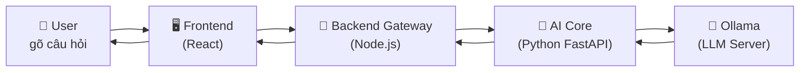
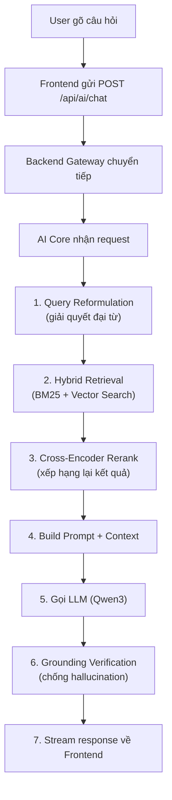
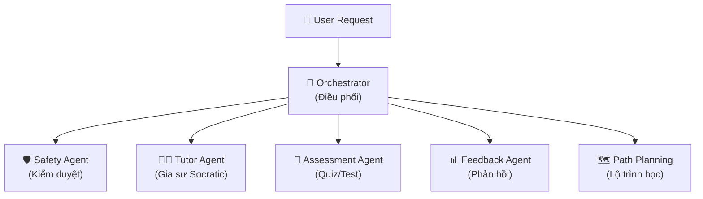

# 🧠 NeuroVault — Giải Thích Hệ Thống Chat AI

> **Dành cho người chưa biết gì về dự án.** Tài liệu này giải thích từ A→Z cách phần Chat AI hoạt động.

---

## 1. Tổng Quan: Chat AI Hoạt Động Như Thế Nào?

Khi bạn gõ một câu hỏi vào ô chat, hệ thống sẽ đi qua **4 tầng** trước khi trả lời:



| Tầng | Công nghệ | Vai trò |
|------|-----------|---------|
| **Frontend** | React + Vite | Giao diện chat, gửi/nhận tin nhắn |
| **Backend Gateway** | Node.js + Express | Xác thực user, chuyển tiếp request |
| **AI Core** | Python + FastAPI | Xử lý NLP, tìm kiếm tài liệu, tạo câu trả lời |
| **Ollama** | Local LLM Server | Chạy model AI (Qwen3 1.7B) trên máy |

> [!IMPORTANT]
> **Triết lý White-Box**: Toàn bộ pipeline NLP được **tự viết 100%** bằng Python thuần. KHÔNG dùng bất kỳ thư viện NLP bên ngoài nào (không LangChain, không spaCy, không HuggingFace). Mục đích: hiểu rõ mọi bước xử lý.

---

## 2. Model AI Sử Dụng

### 2.1. Model chính: Qwen3 1.7B

| Thuộc tính | Giá trị |
|-----------|--------|
| **Tên model** | `qwen3:1.7b` |
| **Nhà phát triển** | Alibaba (Qwen Team) |
| **Kích thước** | 1.7 tỷ tham số |
| **License** | Apache 2.0 (miễn phí thương mại) |
| **Chạy qua** | Ollama (local, không gọi API bên ngoài) |
| **URL mặc định** | `http://127.0.0.1:11434` |
| **VRAM yêu cầu** | ~2-3 GB (phù hợp RTX 3050 4GB) |

**File cấu hình**: [llm_engine.py](file:///e:/AI_Learning_Platform/backend/ai_core/inference/llm_engine.py#L97)
```python
# Model priority: explicit param → env var → default
self.model = model or os.getenv("LLM_MODEL", "qwen3:1.7b")
```

### 2.2. Tại sao chọn Qwen3 1.7B?
- **Nhỏ gọn**: chạy được trên GPU 4GB VRAM (RTX 3050)
- **Nhanh**: inference nhanh hơn các model lớn (7B, 13B)
- **Miễn phí**: license Apache 2.0
- **Hỗ trợ tiếng Việt**: trained trên dữ liệu đa ngôn ngữ

### 2.3. Training — Dự án KHÔNG tự train model

> [!NOTE]
> NeuroVault **KHÔNG tự train** model LLM. Dự án sử dụng model pre-trained (Qwen3 1.7B) đã được Alibaba train sẵn. Điều dự án **tự xây dựng 100%** là toàn bộ pipeline xung quanh: tiền xử lý, tìm kiếm, prompt engineering, agent system, v.v.

---

## 3. Luồng Xử Lý Khi User Hỏi Câu Hỏi

Khi user gõ "Machine Learning là gì?" vào chat, đây là **toàn bộ hành trình**:



---

## 4. Tiền Xử Lý Tài Liệu (Document Processing Pipeline)

**Trước khi chat**, tài liệu phải được xử lý qua pipeline này:

```
PDF/DOCX/TXT → Parse → Clean → Detect Language → Split Sentences
→ Semantic Chunk → Embed → Index (BM25 + Vector) → Persist to Disk
```

### 4.1. Parse tài liệu
**File**: [pdf_parser.py](file:///e:/AI_Learning_Platform/backend/ai_core/preprocessing/pdf_parser.py)

Trích xuất text thô từ file PDF/DOCX/TXT. Dùng thư viện `PyMuPDF` cho PDF, `python-docx` cho DOCX.

### 4.2. Làm sạch text (Text Cleaning)
**File**: [text_cleaner.py](file:///e:/AI_Learning_Platform/backend/ai_core/preprocessing/text_cleaner.py)

Pipeline 9 bước, **tự viết 100%** bằng Python built-in:

| Bước | Mô tả | Công cụ Python |
|------|-------|---------------|
| 1 | Unicode NFC normalization | `unicodedata.normalize('NFC')` |
| 2 | HTML entity decode | `html.unescape()` |
| 3 | Smart quotes → ASCII | `str.replace()` |
| 4 | Fix hyphenation (từ bị ngắt qua dòng) | `re.sub(r'(\w+)-\s*\n\s*(\w+)')` |
| 5 | Xóa control characters | Regex `[\x00-\x08...]` |
| 6 | Chuẩn hóa bullet points | Regex Unicode bullets |
| 7 | Gộp khoảng trắng thừa | Regex `[ \t]+` → ` ` |
| 8 | Strip mỗi dòng | `line.strip()` |
| 9 | Trim toàn bộ | `text.strip()` |

### 4.3. Phát hiện ngôn ngữ
**File**: [language_detector.py](file:///e:/AI_Learning_Platform/backend/ai_core/preprocessing/language_detector.py)

Đếm ký tự có dấu tiếng Việt (à, á, ả, ã, ạ...). Nếu tỷ lệ > 2% → tiếng Việt.

### 4.4. Tách câu (Sentence Splitting)
**File**: [sentence_splitter.py](file:///e:/AI_Learning_Platform/backend/ai_core/preprocessing/sentence_splitter.py)

Tách text thành từng câu dựa trên dấu `.`, `!`, `?`, có xử lý ngoại lệ (viết tắt, số thập phân...).

### 4.5. Semantic Chunking — ⭐ Module quan trọng nhất
**File**: [semantic_chunker.py](file:///e:/AI_Learning_Platform/backend/ai_core/preprocessing/semantic_chunker.py)

> Thay vì cắt cứng nhắc (mỗi 500 từ), module này **phát hiện ranh giới ngữ nghĩa** — nơi chủ đề thay đổi.

**Thuật toán**:
1. Tạo **sliding windows** (cửa sổ trượt, mỗi window = 3 câu)
2. Tính **TF-IDF vector** cho mỗi window
3. Tính **cosine similarity** giữa windows liền kề
4. Nếu similarity **giảm mạnh** (< 0.3) → đó là **ranh giới chunk**
5. Post-process: merge chunk quá ngắn (< 50 từ), split chunk quá dài (> 500 từ)

### 4.6. Embedding (Tạo vector)
**File**: [embedding_engine.py](file:///e:/AI_Learning_Platform/backend/ai_core/embedding/embedding_engine.py)

Biến text thành vector số (128 chiều) để so sánh similarity:

```
Text → Tokenize → TF-IDF sparse vector → Truncated SVD → Dense vector (128D) → L2 Normalize
```

- **TF-IDF**: Tính trọng số từ (từ hiếm = quan trọng hơn)
- **Truncated SVD**: Giảm chiều (thuật toán Halko-Martinsson-Tropp, tự implement)
- **OOV Fallback**: Character n-gram hashing cho từ lạ (kiểu FastText)

### 4.7. Indexing (Lập chỉ mục)
Mỗi chunk được index bằng **2 phương pháp song song**:

| Phương pháp | File | Mô tả |
|------------|------|-------|
| **BM25** (sparse) | [bm25.py](file:///e:/AI_Learning_Platform/backend/ai_core/retrieval/bm25.py) | Tìm kiếm từ khóa (Okapi BM25, tự implement) |
| **Vector Store** (dense) | [vector_store.py](file:///e:/AI_Learning_Platform/backend/ai_core/retrieval/vector_store.py) | Tìm kiếm ngữ nghĩa (cosine similarity) |

---

## 5. Hệ Thống RAG (Retrieval-Augmented Generation)

**File chính**: [rag_pipeline.py](file:///e:/AI_Learning_Platform/backend/ai_core/inference/rag_pipeline.py)

RAG = "Tìm tài liệu liên quan → Đưa vào prompt → LLM trả lời dựa trên tài liệu"

### 5.1. Bước 1: Query Reformulation
Giải quyết **đại từ** và **câu hỏi ngắn** trong hội thoại nhiều lượt:

```
Lượt 1: User: "Machine Learning là gì?"
Lượt 2: User: "Nó có mấy loại?"
         ↓ Reformulate
         "Machine Learning có mấy loại?"
```

- Dùng **LLM** để viết lại câu hỏi (nếu LLM online)
- **Fallback rule-based**: thay thế đại từ bằng chủ đề gần nhất

### 5.2. Bước 2: Hybrid Retrieval
Tìm kiếm **2 kênh song song**, rồi kết hợp:

```
Query → [BM25 Search] ──→ Reciprocal Rank Fusion → Top K chunks
      → [Vector Search] ─┘
```

- **BM25**: Tìm theo từ khóa chính xác (lexical match)
- **Vector**: Tìm theo ý nghĩa (semantic match)
- **Hybrid Ranker** ([hybrid_ranker.py](file:///e:/AI_Learning_Platform/backend/ai_core/retrieval/hybrid_ranker.py)): Kết hợp bằng Reciprocal Rank Fusion (RRF)

### 5.3. Bước 3: Cross-Encoder Rerank
**File**: [cross_encoder_reranker.py](file:///e:/AI_Learning_Platform/backend/ai_core/retrieval/cross_encoder_reranker.py)

Xếp hạng lại kết quả bằng 4 tín hiệu:

| Tín hiệu | Trọng số | Mô tả |
|----------|---------|-------|
| Semantic (TF-IDF cosine) | 40% | Độ tương đồng ngữ nghĩa |
| Lexical (term overlap) | 30% | Trùng từ khóa trực tiếp |
| Position bias | 10% | Chunk đầu tài liệu ưu tiên hơn |
| Concept overlap | 20% | Khớp khái niệm chủ đề |

### 5.4. Bước 4: LLM Generate
Ghép context + câu hỏi thành prompt, gọi LLM:

```
System: "Bạn là NeuroVault AI — trợ lý học tập. Trả lời DỰA TRÊN tài liệu..."
Context: [Passage 1] ... [Passage 2] ... [Passage 3] ...
User: "Machine Learning là gì?"
```

### 5.5. Bước 5: Grounding Verification (Chống Hallucination)
Kiểm tra câu trả lời **có dựa trên tài liệu không**:

1. Tách response thành từng câu
2. Với mỗi câu, đếm % từ khóa trùng với context
3. Nếu > 30% từ trùng → câu đó "grounded"
4. Score = grounded_claims / total_claims
5. Nếu score > 50% → response đáng tin cậy

---

## 6. Multi-Agent System (Hệ Thống Đa Agent)



### 6.1. Orchestrator (Bộ điều phối)
**File**: [orchestrator.py](file:///e:/AI_Learning_Platform/backend/ai_core/agents/orchestrator.py)

- **Phân loại ý định** (Intent Classification): Dùng keyword matching + LLM fallback
- **Chọn agent**: Map intent → capability → agent phù hợp
- **Safety check**: Chạy Safety Agent song song
- **Handoff**: Chuyển giao giữa các agent nếu cần

**Ví dụ phân loại**:
```
"Giải thích gradient descent" → intent: EXPLAIN → TutorAgent
"Tạo quiz cho tôi"          → intent: QUIZ    → AssessmentAgent
"Hello, bạn là ai?"         → intent: CHAT    → TutorAgent (fallback)
```

### 6.2. Tutor Agent (Gia sư Socratic)
**File**: [tutor_agent.py](file:///e:/AI_Learning_Platform/backend/ai_core/agents/tutor_agent.py)

Dạy học theo **phương pháp Socratic** — hỏi ngược lại thay vì đưa đáp án:

| Phase | Mô tả |
|-------|-------|
| **Eliciting** | Hỏi learner biết gì về topic |
| **Probing** | Đào sâu reasoning |
| **Clarifying** | Làm rõ misconceptions |
| **Guiding** | Dẫn dắt tới đáp án đúng |
| **Reconciling** | Tổng kết kiến thức |
| **Encouraging** | Khuyến khích khi learner thất vọng |

**Adaptive Scaffolding** — Tự điều chỉnh theo trình độ:

| Level | Mastery | Gợi ý | Độ khó |
|-------|---------|-------|--------|
| Novice | < 0.3 | 5 gợi ý chi tiết | Đơn giản |
| Intermediate | 0.3-0.6 | 3 gợi ý vừa | Trung bình |
| Advanced | 0.6-0.85 | 2 gợi ý ngắn | Thách thức |
| Expert | ≥ 0.85 | 1 gợi ý tối thiểu | Chuyên gia |

### 6.3. Safety Agent (Kiểm duyệt)
**File**: [safety_agent.py](file:///e:/AI_Learning_Platform/backend/ai_core/agents/safety_agent.py)

Bảo vệ hệ thống khỏi nội dung độc hại:
- **Rule-based**: Compiled regex patterns (< 1ms)
- **LLM-based**: Phân tích ngữ cảnh sâu (nếu cần)
- **Categories**: Prompt Injection, Toxicity, Self-harm, Violence, Illegal, PII
- **Self-harm đặc biệt**: Trả số hotline hỗ trợ tâm lý thay vì chặn

---

## 7. Hệ Thống Bộ Nhớ 4 Tầng

**File**: [agent_memory.py](file:///e:/AI_Learning_Platform/backend/ai_core/agents/agent_memory.py)

| Tầng | Tuổi thọ | Lưu gì |
|------|----------|--------|
| **Working Memory** | 1 turn | Biến tạm, reasoning state |
| **Short-term Memory** | 1 session | Lịch sử chat (50 turns), tool cache |
| **Episodic Memory** | Vĩnh viễn (file JSON) | Tóm tắt các phiên học trước |
| **Long-term Memory** | Vĩnh viễn (file JSON) | Facts: "Học sinh thích ví dụ thực tế" |

---

## 8. Frontend — Giao Diện Chat

### 8.1. StreamingChatBox
**File**: [StreamingChatBox.jsx](file:///e:/AI_Learning_Platform/frontend/src/components/chat/StreamingChatBox.jsx)

- Sử dụng **SSE (Server-Sent Events)** để stream token-by-token
- **AbortController** để cancel request khi user nhấn Stop
- Hiển thị **grounding score** (% câu trả lời dựa trên tài liệu)
- Hiển thị **source citations** (trích dẫn nguồn)
- Lưu lịch sử chat per-document trong `localStorage`
- Hỗ trợ **Voice Input** (Speech-to-Text) và **TTS** (Text-to-Speech)

---

## 9. Bản Đồ File Code

```
backend/ai_core/
├── api/
│   └── ai_server.py          ← FastAPI server, tất cả endpoints
├── preprocessing/             ← TIỀN XỬ LÝ TÀI LIỆU
│   ├── pdf_parser.py          ← Parse PDF/DOCX/TXT
│   ├── text_cleaner.py        ← Làm sạch text (9 bước)
│   ├── sentence_splitter.py   ← Tách câu
│   ├── semantic_chunker.py    ← ⭐ Chia chunk theo ngữ nghĩa
│   └── language_detector.py   ← Phát hiện EN/VI
├── embedding/
│   └── embedding_engine.py    ← TF-IDF + SVD → vector 128D
├── tokenizer/
│   └── bpe_tokenizer.py       ← BPE tokenizer tự viết
├── retrieval/                 ← TÌM KIẾM TÀI LIỆU
│   ├── bm25.py                ← Okapi BM25 (sparse search)
│   ├── vector_store.py        ← Vector search (dense)
│   ├── hybrid_ranker.py       ← Kết hợp BM25 + Vector (RRF)
│   └── cross_encoder_reranker.py ← Xếp hạng lại (4 tín hiệu)
├── inference/                 ← SUY LUẬN AI
│   ├── llm_engine.py          ← ⭐ Kết nối Ollama, gọi LLM
│   ├── rag_pipeline.py        ← ⭐ RAG: Retrieve → Generate
│   └── topic_tracker.py       ← Theo dõi chủ đề hội thoại
├── agents/                    ← HỆ THỐNG ĐA AGENT
│   ├── base_agent.py          ← Abstract base class
│   ├── orchestrator.py        ← ⭐ Bộ điều phối chính
│   ├── tutor_agent.py         ← ⭐ Gia sư Socratic
│   ├── safety_agent.py        ← Kiểm duyệt nội dung
│   ├── agent_memory.py        ← Bộ nhớ 4 tầng
│   ├── agent_context.py       ← Context sharing
│   ├── agent_message.py       ← Message protocol
│   └── agent_state.py         ← State machine
├── knowledge/                 ← KIẾN THỨC
│   ├── concept_extractor.py   ← Trích xuất khái niệm
│   └── graph_builder.py       ← Knowledge graph
└── generation/                ← TẠO NỘI DUNG
    ├── quiz_generator.py      ← Tạo câu hỏi quiz
    ├── flashcard_generator.py ← Tạo flashcard
    └── summary_generator.py   ← Tóm tắt tài liệu

frontend/src/components/chat/
├── StreamingChatBox.jsx       ← ⭐ Giao diện chat streaming
└── ChatBox.jsx                ← Chat non-streaming (legacy)
```

---

## 10. Ví Dụ End-to-End

> User upload file `"ML_textbook.pdf"` rồi hỏi `"Gradient descent là gì?"`

**Bước 1 — Document Processing** (xảy ra khi upload):
```
ML_textbook.pdf
  → PDFParser.parse() → raw text (5000 từ)
  → TextCleaner.clean() → text sạch
  → LanguageDetector.detect() → "en"
  → SentenceSplitter.split() → 120 câu
  → SemanticChunker.chunk() → 15 chunks
  → EmbeddingEngine.embed() → 15 vectors (128D)
  → BM25.index() + VectorStore.add() → indexed
  → save_doc_store() → persisted to disk
```

**Bước 2 — Chat** (xảy ra khi user hỏi):
```
"Gradient descent là gì?"
  → QueryReformulator → không cần reformulate (câu đầu tiên)
  → BM25.search("gradient descent") → [chunk_3, chunk_7, chunk_11]
  → VectorStore.search(embed("gradient descent")) → [chunk_3, chunk_5, chunk_7]
  → HybridRanker.rerank() → [chunk_3, chunk_7, chunk_5, chunk_11]
  → CrossEncoderReranker.rerank() → [chunk_3, chunk_7, chunk_5]
  → Build prompt: System + Context(3 chunks) + User query
  → LLMEngine.chat(messages) → Ollama → Qwen3 1.7B → response
  → _verify_grounding(response, chunks) → grounding_score: 0.85
  → Stream response về Frontend via SSE
```

---

## 11. Tóm Tắt Các Điểm Quan Trọng

| Câu hỏi | Trả lời |
|---------|---------|
| **Dùng model gì?** | Qwen3 1.7B, chạy local qua Ollama |
| **Có training không?** | KHÔNG tự train. Dùng model pre-trained |
| **Tiền xử lý thế nào?** | 9-bước cleaning → sentence split → semantic chunk → TF-IDF+SVD embed |
| **Tìm kiếm tài liệu?** | Hybrid (BM25 + Vector) → Cross-Encoder Rerank |
| **Chống hallucination?** | Grounding Verification (đếm keyword overlap) |
| **Có dùng thư viện NLP?** | KHÔNG. Tất cả tự viết 100% (White-Box) |
| **Chat streaming?** | SSE (Server-Sent Events) token-by-token |
| **Bảo mật?** | Safety Agent (regex + LLM moderation) |
